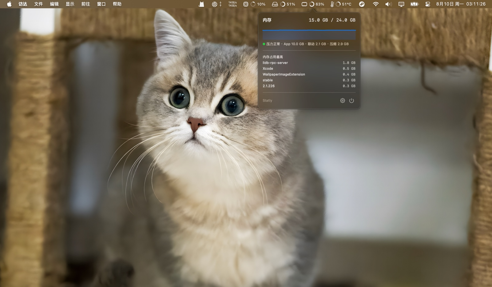
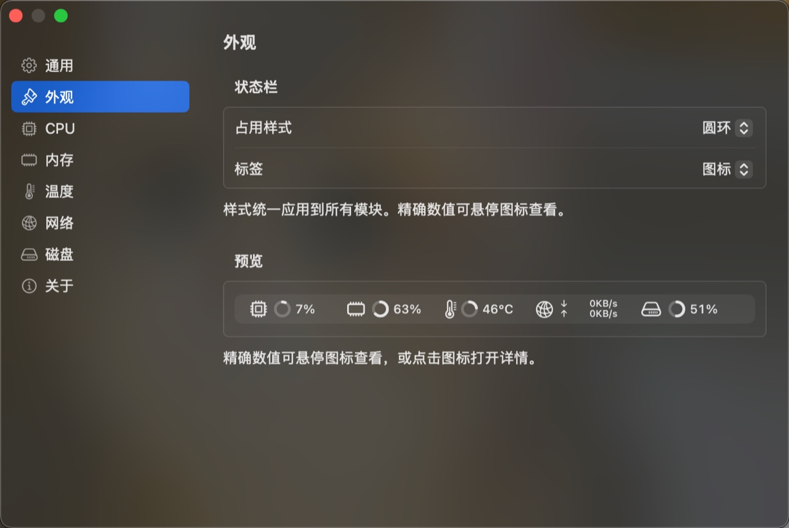

<p align="center">
    <a href="https://linux.do" alt="LINUX DO">
        </a>
</p>

<div align="center">
  
  <h1>Statly</h1>
  <p><b>A lightweight system monitor for macOS</b></p>
  <p>
    
    
    
    
    
  </p>
  <p><b>English</b> · <a href="README.zh-CN.md">简体中文</a></p>
</div>

Statly is a lightweight system monitor for macOS that lives in the menu bar, showing CPU, memory, temperature, network rate, and disk usage in real time. Click any icon to open a detail panel for that module.

Designed with resource usage as the primary constraint: menu bar content is drawn off-screen with AppKit, SwiftUI is used only for the on-demand detail panels and settings window; a single process, zero third-party dependencies, a 0.71 MB bundle, no background daemons, and no system permissions required.



## Features

- **Modular** — Each of the five metrics is an independent menu bar icon, individually enabled/disabled, reorderable by ⌘-dragging, with position persisted.
- **Menu bar display** — Usage metrics shown as ring + percentage; network rate as up/down rows; values use a monospaced font with reserved width to avoid layout jitter.
- **Configurable styles** — Usage style (ring + percentage / plain text) and label style (icon / vertical / horizontal text / hidden) freely combined, with live preview in the settings window.
- **Dual temperature display** — The thermometer icon's mercury level changes across three tiers (<50°C / 50–80°C / ≥80°C); the ring fills by the reading, consistent with other modules.
- **Selectable temperature source** — Switch between CPU (hottest die sensor) and battery; automatically disabled on desktops without a battery sensor.
- **Detail panels** — Historical curves per module; CPU/memory list the top 5 processes, memory adds pressure state and breakdown, network adds local IP / gateway / DNS / public IP, disk adds a capacity bar and read/write rates.
- **Hover tooltips** — Hover an icon in ring mode for the exact value.
- **System integration** — Template images adapt to light/dark appearance; settings use system grouped cards and vibrancy; UI in Simplified Chinese.
- **Low overhead** — One shared timer wake per sample cycle; no redraw when results are unchanged; sampling pauses while locked/asleep; process lists are collected only while the panel is open.
- **No residue** — No Dock icon, no login-item daemon; uninstalling is just deleting the app and one config file.

## Installation

Download the DMG from [Releases](https://github.com/imliusx/statly/releases) and drag Statly into the Applications folder. Requires **macOS 13 or later**.

> Not currently notarized by Apple. On first launch, right-click the app → Open, or run `xattr -d com.apple.quarantine /Applications/Statly.app`.

Uninstall:

```sh
rm -rf /Applications/Statly.app
defaults delete com.statly.app
```

## Usage

| Action | Effect |
|--------|--------|
| Click an icon | Open that module's detail panel |
| Hover an icon | Tooltip with the exact value |
| Right-click any icon | Settings / About / Check for Updates / Quit |
| ⌘ + drag | Reorder icons |

| Module | Menu bar | Detail panel |
|--------|----------|--------------|
| CPU | Total usage | Usage curve, top 5 processes |
| Memory | Used ratio | Usage curve, App / Wired / Compressed breakdown, top 5 processes |
| Temperature | Hottest of selected source | Temperature curve, average and sensor count |
| Network | Live up/down rates | Rate curves, local IP / gateway / DNS, public IP and ISP |
| Disk | Used capacity ratio | Capacity bar, read/write rates |

## Settings

Organized by module, with live style preview. Sample interval of 1 / 2 / 5 seconds, default 2. Launch at login is built on `SMAppService`; the public IP lookup can be disabled in settings — no outbound requests at all once disabled.



## Performance

Measured (Apple Silicon, all five modules, 2-second interval):

| Metric | Target | Measured |
|--------|--------|----------|
| Bundle size | < 10 MB | **0.71 MB** |
| Resident memory (RSS, panels closed) | < 35 MB | **32 MB** |
| Timer wakes per sample cycle | 1 | **1** (all modules combined) |
| Background processes / privileges / root | 0 | **0** |
| Average CPU usage | < 0.5% | **0.42%** |

Implementation constraints:

- **Combined wake** — All modules share a single `DispatchSourceTimer`.
- **Diff updates** — Skips the `NSStatusItem` call when output is unchanged from the previous cycle.
- **Pause while hidden** — Sampling stops while locked/asleep; baselines reset on resume to avoid rate spikes.
- **On-demand collection** — Process lists and network info are collected only while the panel is open.
- **Temperature throttling** — Fixed 5-second sampling of a small sensor subset (4 CPU / 2 battery); per-sample cost drops from 16.7 ms to 3.6 ms, within 0.01°C of the full read.

CPU usage breakdown (from sampling profiler and controlled benchmarks):

| Source | Share |
|--------|-------|
| Inherent AppKit cost of updating menu bar items | ~0.23% |
| Statly's own sampling and rendering | ~0.06% |
| Rest (timers, event loop, etc.) | ~0.13% |

The 0.23% is the measured floor of a minimal control program (just swapping two menu bar item images every 2 seconds still costs 0.21–0.25%), so 0.3% is unreachable at a 2-second interval. The original < 0.3% target was revised to < 0.5%; at a 5-second interval it's ~0.2%.

## Community

Thanks to [LINUX DO](https://linux.do/) for providing a friendly community for technical exchange and open-source sharing.

## License

[MIT](LICENSE) © 2026 liusx
